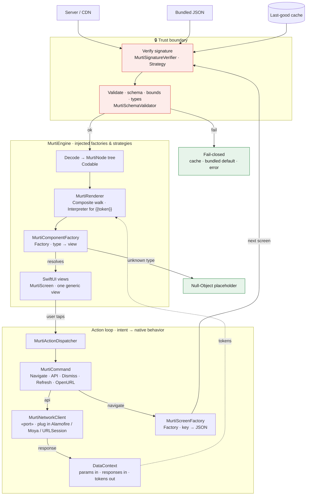

# Murti

[](https://github.com/iQbalADR/murti/actions/workflows/ci.yml)
[](https://iqbaladr.github.io/murti/)
[](https://swift.org)
[](https://github.com/iQbalADR/murti)
[](https://github.com/iQbalADR/murti)
[](LICENSE)

> A SwiftUI-native **server-driven UI** framework — render screens from JSON,
> navigate and call APIs declaratively, extend with any third-party component,
> with fintech-grade validation and security.

The server describes *what* a screen is; the client owns *how* it renders,
navigates, and talks to the network. Ship layout changes without an App Store
release. Deliberately **SwiftUI-only** — a strength, not a limitation.

> **Status:** early development. The core engine (render + actions + validation +
> signature verification + versioned secure caching) is built, tested, and
> CI-checked; APIs may still change before 1.0.

---

## Requirements

- Swift 6, Xcode 16+
- iOS 17+ / iPadOS 17+ / macOS 14+ (SwiftUI `NavigationStack` + Observation)
- Swift Package Manager

```swift
// Package.swift
dependencies: [
    .package(url: "https://github.com/iQbalADR/murti.git", branch: "main"),
]
// add "MurtiCore" to your target's dependencies
```

---

## Quickstart

```swift
import SwiftUI
import MurtiCore

// 1. Create the engine, giving it the component/screen factories and the action dispatcher.
let engine = MurtiEngine(
    componentFactory: .withBuiltins,                 // text, image, vstack, hstack, button, card
    screenFactory: MurtiScreenFactory().register("home", data: homeJSON),
    actionDispatcher: MurtiActionDispatcher(
        network: MyNetworkClient(),                  // your adapter — see docs/networking.md
        navigator: MurtiNavigator(navigate: { screen, params in /* push a route */ })
    )
)

// 2. MurtiScreen loads the JSON registered for "home" and renders it.
struct RootView: View {
    var body: some View {
        NavigationStack {
            MurtiScreen(.key("home"), engine: engine)
        }
    }
}
```

### Add a component

```swift
// A) as a type — single file, testable
struct RatingComponent: MurtiComponent {
    static let type = "rating"
    func makeView(_ node: MurtiNode, context: MurtiRenderContext) -> AnyView {
        AnyView(StarRating(value: node.int("stars")))
    }
}
engine.componentFactory.register(RatingComponent())

// B) inline — wrap ANY library in one line, no new type, no module
engine.componentFactory.register("lottie") { node, _ in
    LottieView(animation: .named(node.string("name")))
}
```

The JSON author then writes `{ "type": "rating", "props": { "stars": 4 } }` or
`{ "type": "lottie", "props": { "name": "success" } }` — and never knows the
library exists. An unregistered type degrades to a safe placeholder, never a crash.

---

## Architecture

One request travels through a **render pipeline** (top → bottom) and comes back
through an **action loop** (bottom → top). Every box is annotated with the design
pattern it embodies.



### Reading the diagram

| Pattern | Where it lives | What varies |
| --- | --- | --- |
| **Factory / Abstract Factory** | `MurtiComponentFactory`, `MurtiScreenFactory` | a `type`/`key` string → an object |
| **Command** | `MurtiCommand` set (Navigate, API, Dismiss, Refresh, OpenURL) | each action is self-contained; closed vocabulary, no logic in JSON |
| **Strategy / Ports & Adapters** | `MurtiNetworkClient`, `MurtiSignatureVerifier`, `MurtiCacheStore`, `MurtiCacheCipher` | plug in an implementation without touching core |
| **Composite + Interpreter** | `MurtiRenderer` | walk the `MurtiNode` tree; resolve `{{token}}` against the data context |
| **Null Object** | unknown-component fallback | a safe placeholder — never a crash, forward-compatible |
| **Dependency Injection** | `MurtiEngine` | receives its factories/strategies; no global singletons → testable |

**Safety rails baked into the path:** the 🔒 trust boundary verifies before
anything is trusted, validation is bounded to prevent DoS, unknown components
degrade to a Null-Object placeholder, and any failure is **fail-closed** —
last-good cache, bundled default, or an error state, never a blank screen or a
crash.

---

## Modules

| Module | Role | Dependencies |
| --- | --- | --- |
| `MurtiCore` | Engine, registries, renderer, validation, signing | **zero** third-party |
| `MurtiLottie`, `MurtiCharts`, … | Optional self-registering component modules | the wrapped library |

Networking libraries (Alamofire / Moya / URLSession) plug into the
`MurtiNetworkClient` **port** as a small adapter in your app — see
[docs/networking.md](docs/networking.md) — not a Murti package. Wrapping **any**
library is one self-registering component (or the one-line closure above).

---

## Networking

`MurtiCore` ships **no** network client — only the `MurtiNetworkClient` port. Plug
in Alamofire, Moya, or `URLSession` as a ~15-line adapter; swap libraries by
swapping the adapter and nothing else changes.
[docs/networking.md](docs/networking.md) has the diagram + ready adapters.

## Security

Signing is a toggle — insecure-by-default *by name*, so an unsigned production
build is obvious in review:

```swift
MurtiEngine(…, security: .insecureDevelopment)          // dev: unsigned payloads OK

let verifier = try Ed25519Verifier(publicKey: embeddedPublicKeyData)
MurtiEngine(…, security: .signed(verifier))             // prod: require + verify
```

Verification runs on **every** load — including from cache — so a poisoned cache
is caught, not just a bad download. Plus bounded validation (depth / node / chain
caps) and the closed action vocabulary. The framework provides the *mechanisms*;
you own key management and endpoints — it never claims to be "secure" for you.

## Caching

`MurtiCore` ships an optional, signed, versioned cache — off unless you wire it:

```swift
MurtiEngine(…, cache: MurtiCache(store: FileCacheStore(), cipher: PassthroughCipher()))
```

Call `try await engine.refreshManifest()` (adopter-triggered) to pull the signed
version manifest — which version of each screen is current. The cache is three
tiers: an in-memory decoded-node tier, and an on-disk tier of signed envelopes
(written with Data Protection, optionally encrypted via `AESGCMCipher`), driven by
the manifest and keyed by `screenKey@version`. Every disk load **re-verifies the
signature** before use — fail-closed, so a poisoned entry is evicted, never
rendered. Offline, the last-good version is served (itself re-verified). Warm a
key ahead of navigation with `await engine.prefetch(["home"])`.

## Demo — the gallery

`MurtiGallery` is a runnable Storybook: every component, a JSON/Preview toggle, an
action banner that shows dispatched actions, and a paste-JSON hot-reload harness.

```
swift run MurtiGallery        # macOS
```

Or open `Package.swift` in Xcode and run the **MurtiGallery** scheme (Mac or iOS
simulator).

## Docs

- [Authoring screens](docs/authoring.md) — the MurtiBuilder DSL for writing
  screens in Swift, and MurtiGen for build-time JSON generation.
- [Payload schema & validation](docs/schema.md) — the authoritative JSON Schema,
  `schemaVersion` policy, bounds, and valid/invalid fixtures.
- [Networking adapters](docs/networking.md) — the port + Alamofire / Moya /
  URLSession adapters.
- [Contributing](CONTRIBUTING.md).

## License

[Apache-2.0](LICENSE).
