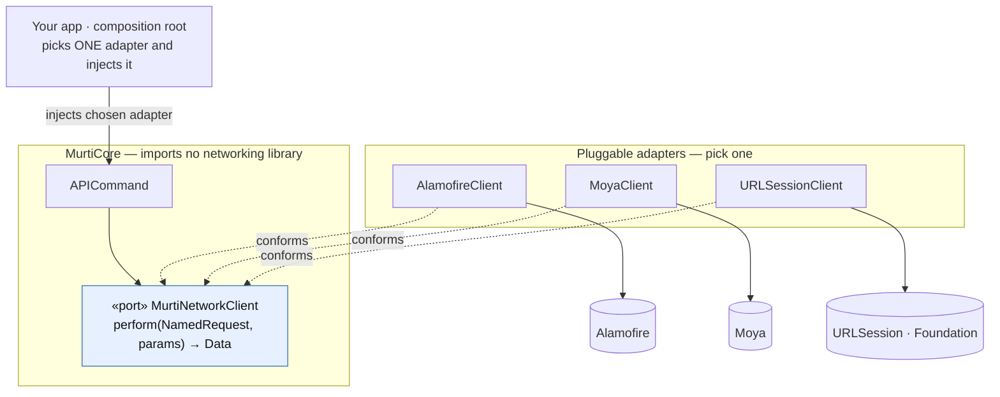

# Networking — a port you plug into, not a client Murti builds

Murti does **not** build, ship, or force a network client. `MurtiCore` imports
**no** networking library. It defines one **port** (a protocol), and you plug in an
**adapter** that wraps whatever you already use — **Alamofire**, **Moya**, or plain
**`URLSession`**. Swap libraries by swapping the adapter; the engine never changes.

This is the Strategy / Ports-and-Adapters pattern (dependency inversion): the
engine depends on the abstraction, each adapter depends on the abstraction *and* a
library, and your app picks which adapter to inject.

## The port (all `MurtiCore` defines)

```swift
public protocol MurtiNetworkClient: Sendable {
    func perform(_ request: NamedRequest, params: [String: MurtiValue]) async throws -> Data
}
```

The whole contract: given an allow-listed named request + params, return `Data`.
Library types (`AFError`, Moya's `Response`) never cross this boundary.

## The picture



Core points **only** at the port. Adapters point at the port (conform) and at a
library (wrap). Your app is the only place that names a concrete library.

## Adapters (pick one — ~15 lines each)

Each maps `NamedRequest` → your real endpoint (the app owns that mapping and its
auth/pins; Murti can't know them).

### `URLSession` — zero third-party dependencies (pinning via delegate)

```swift
import Foundation
import MurtiCore

struct URLSessionClient: MurtiNetworkClient {
    let baseURL: URL
    let session: URLSession   // a session whose delegate does cert pinning

    func perform(_ request: NamedRequest, params: [String: MurtiValue]) async throws -> Data {
        let urlRequest = Endpoints.build(request, params: params, baseURL: baseURL)
        let (data, response) = try await session.data(for: urlRequest)
        guard let http = response as? HTTPURLResponse, (200..<300).contains(http.statusCode) else {
            throw MurtiError.network(status: (response as? HTTPURLResponse)?.statusCode)
        }
        return data
    }
}
```

### Alamofire — pinning via `ServerTrustManager`

```swift
import Alamofire
import MurtiCore

struct AlamofireClient: MurtiNetworkClient {
    let session: Session   // Session(serverTrustManager: ServerTrustManager(evaluators: …))

    func perform(_ request: NamedRequest, params: [String: MurtiValue]) async throws -> Data {
        let endpoint = Endpoints.build(request, params: params)   // → URL + HTTPMethod
        return try await session.request(endpoint.url, method: endpoint.method)
            .validate()
            .serializingData()
            .value
    }
}
```

### Moya — via `TargetType`

```swift
import Moya
import MurtiCore

struct MoyaClient: MurtiNetworkClient {
    let provider: MoyaProvider<AppTarget>

    func perform(_ request: NamedRequest, params: [String: MurtiValue]) async throws -> Data {
        let target = AppTarget(request: request, params: params)   // map to your TargetType
        return try await withCheckedThrowingContinuation { continuation in
            provider.request(target) { result in
                switch result {
                case .success(let response): continuation.resume(returning: response.data)
                case .failure: continuation.resume(throwing: MurtiError.network(status: nil))
                }
            }
        }
    }
}
```

## Wiring (composition root)

```swift
let client: any MurtiNetworkClient = AlamofireClient(session: pinnedSession)

let engine = MurtiEngine(
    componentFactory: .withBuiltins,
    screenFactory: screens,
    actionDispatcher: MurtiActionDispatcher(network: client, navigator: navigator)
)
```

Swap `AlamofireClient` for `MoyaClient` or `URLSessionClient` — nothing else in the
app changes. That is the plug.

## Same pattern everywhere

Components (Lottie, charts) plug into `MurtiComponent`, signature verification into
`MurtiSignatureVerifier`, caching into its own port. Murti defines the protocol;
you plug in the implementation. Nothing library-specific ever lives in `MurtiCore`.
